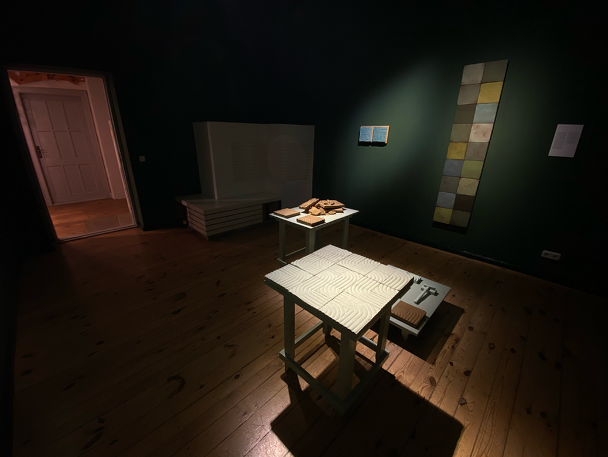

# Life-Time Featured Old Projects

- [**"We want to live!"**](https://www.youtube.com/watch?v=3V1NKcxF2OI) (2015 – 14 years old) –> I entered my first animated LEGO short film into a Bratislava Slovak competition. We were awarded with 3rd place. I believe that we won thanks to the cooperation of my friends.
  
- [**"World of Plastic"**](https://www.youtube.com/watch?v=VX3JhoW89X4) (2016 – 15 years old) –> Animated LEGO short film. We were awarded 1st place in the Bratislava Slovak competition.

- [**"Life with ISIC"**](https://www.youtube.com/watch?v=07TXVp8rjss&t=9s) (2017 – I was 16 years old) –> Music video about ISIC student card. We were awarded 1st place in the Košice Slovak competition. Thanks to this, I had the opportunity to be the main actor in short ISIC ads:
- [**Add Performance 1**](https://www.youtube.com/watch?v=N6iNbw7amuk),
- [**Add Performance 2**](https://www.youtube.com/watch?v=PuG0568k_2E),
- [**Add Performance 3**](https://www.youtube.com/watch?v=VnI_E2yEMJE)

- [**"Mystery House trailer"**](https://www.youtube.com/watch?v=FhtPwFmSkp4) (2017 – I was 16 years old) –> We were awarded 1st place in Czechoslovak competition.
  
- [**"1 DAY"**](https://www.youtube.com/watch?v=v6IRnz5T7lA) (2019 – I was 18 years old) –> Live-action short film. We were awarded 2nd place in the Košice Slovak competition.

- - [**"Life's Gift"**](https://www.youtube.com/watch?v=WEEqA0LmaMo) (2018) –> Minecraft animated short film. Awarded 3rd place in the Bratislava Slovak competition.

- [**"Power of Friendship"**](https://www.youtube.com/watch?v=0tEriU-heds) (2019) –> Minecraft animated short film. Awarded 2nd place in the Bratislava Slovak competition.

- [**"The Inside trailer"**](https://www.youtube.com/watch?v=C6EL4HapASA) and [**"The Inside short film"**](https://filmfreeway.com/projects/1883986) (2020)

- [**"The Last Letter trailer"**](https://www.youtube.com/watch?v=Np_MfliZ2Rw) and [**"The Last Letter short film"**](https://filmfreeway.com/projects/2082837) (2021)

- [**Videos for Maria Dudova - financial advisor in Bratislava 1**](https://www.youtube.com/watch?v=1KBxY22GWok) (2021)

- [**Videos for Maria Dudova - financial advisor in Bratislava 2**](https://www.youtube.com/watch?v=uS6Ppwye3s4) (2021)

- [**Videos for Maria Dudova - financial advisor in Bratislava 3**](https://www.youtube.com/watch?v=UsmibpPA0Bg) (2021)

- [**Videos for Maria Dudova - financial advisor in Bratislava 4**](https://www.youtube.com/watch?v=gryimh1fu9o) (2021)

# New Era of Featured Projects

- [**"UKUPHILA"**](https://filmfreeway.com/projects/2382005) (2021)

- [**"SEANSA"**](https://www.youtube.com/watch?v=rrN2c0EgOkI) (2022)

- [**"Bees"**](https://www.youtube.com/watch?v=8TpoLYfG1NM) (2022)

- [**"Zombie vs. Ninja"**](https://filmfreeway.com/projects/2504641) (2022)

- [**"Presentation of the art department for the 100th anniversary"**](https://filmfreeway.com/projects/2606470) (2022)

# Background acting in movies:

- [The Performance](https://www.imdb.com/title/tt15300212/) (2021)

- [The Tattooist of Auschwitz](https://www.imdb.com/title/tt9022422/) (2022)

- [Les Loups-Garous](https://www.praguereporter.com/home/2023/7/6/netflix-adaptation-of-werewolf-party-game-starring-jean-reno-now-filming-in-prague/) (2023) (French language)

# Current work/internship

- [Direktorenhaus](https://www.direktorenhaus.com) (current internship)

- [Ai video labs](https://cz.linkedin.com/in/jakub-landa) (current work)
- [Animation/Film instructor for kid's camp](https://www.lks.sk/podujatia/2021_filmarik_animarik) in Slovakia (one week per year)

## [BACK TO THE MAIN PAGE](https://github.com/BenjaminHaverla/First-impression-presentation.git)
